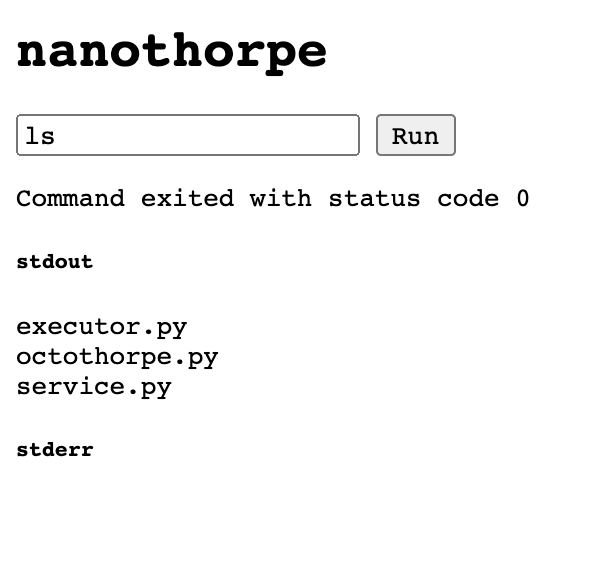

# nanothorpe writeup

## By Matan Hamilis

[Download Link](./nanothorpe-d2095dcfeda4b08d.tar.xz)

In this excercise we are given a link to a simple site.

When entering the page we can see a text box with the word "ls" in it.
When pressing on the button we can see two output sections - stdout and stderr which seem to resemble corresponding stdout and stderr file descriptors of the executions of the "ls" command.
However, when trying to type any other command or even slightly modifying the flags of the "ls" command, we fail and the text "Failed to run the command" showing on the screen.
At this point we get the feeling this question revolves around executing other comands on the server and since this is under the crypto section of the CTF, it will probably has something to do with privileges.

At this point, we get to actually download the file and start and reading the [Dockerfile](./nanothorpe/Dockerfile).
